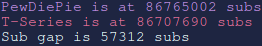

# subgap-cli
check the status of the pewdiepie vs t-series war from your terminal

# setup
install dependencies using `pip install sty google-api-python-client`

go to https://console.developers.google.com/start/api?id=youtube and create or select a project to use.

after you create or select the project click **go to credentials**. for the second question select **other ui** and for the third select **public data**. click **what credentials do i need** and copy the api key. create a file called `key.txt` and paste the key into it and save it.

# usage
after setup just execute `subgap-cli.py` in a terminal and you should be able to see both pewdiepie and t-series sub count and the sub gap